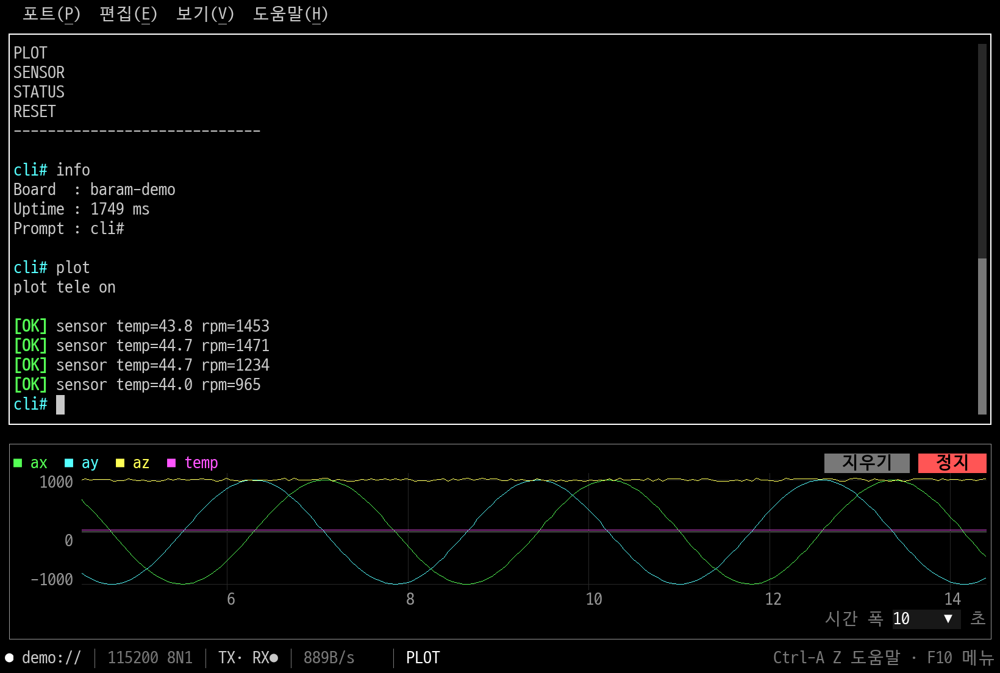
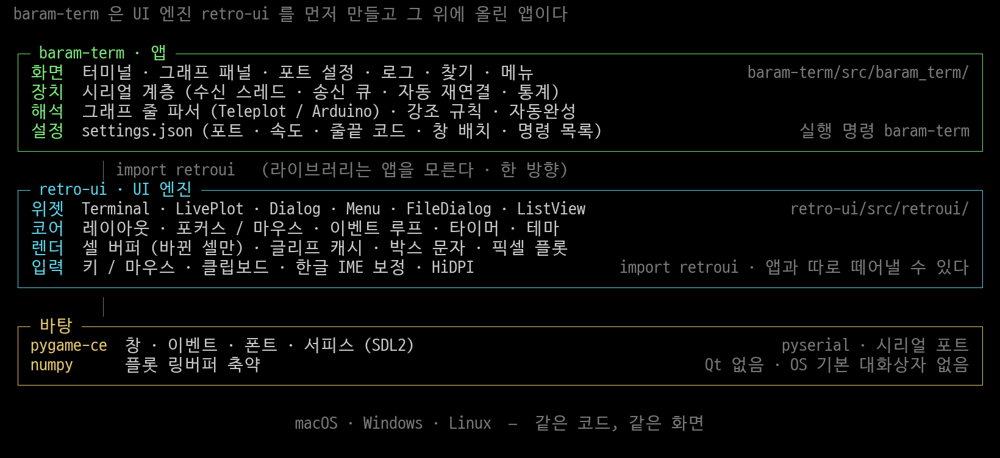

# baram-term

**펌웨어 CLI 시리얼 터미널** — minicom 을 대신해서 쓰려고 만든, 그래프가 붙은 시리얼 터미널.

겉보기는 글자 격자와 박스 문자로 그린 TUI 인데, 실제로는 데스크톱 GUI 창이다.
그래서 터미널 에뮬레이터 안이 아니라 창 하나로 뜨고, 그래프는 글자가 아니라 진짜 픽셀로 그린다.



<sub>보드 없이 `baram-term --demo` 로 띄운 화면. 위는 터미널, 아래는 같은 포트에서 받은 값을 그린 실시간 그래프.</sub>

## 왜 만들었나

펌웨어를 붙잡고 있으면 시리얼 창은 하루 종일 켜 둔다. minicom 은 튼튼하지만,
보드가 찍어 주는 센서 값을 눈으로 보려면 결국 로그를 받아서 따로 그려야 했다.
그래서 **터미널과 실시간 그래프를 한 창에** 두고, 자주 쓰는 것들(찾기, 로그 저장, 자동 재연결)을
기본으로 넣었다.

## 기능

- **시리얼 터미널** — VT100 일부, 스크롤백, 선택·복사·붙여넣기, 타임스탬프, 강조 표시
- **실시간 그래프** — `>name:value` (Teleplot) 와 Arduino 시리얼 플로터 형식을 자동으로 알아본다.
  범례 클릭으로 시리즈 감추기, STOP/지우기, 시간 폭 조절
- **자동 재연결** — 보드를 뽑았다 꽂거나 리셋해도 알아서 다시 붙는다 (부팅 로그를 놓치지 않는다)
- **Tab 자동완성** — `help` 출력에서 명령 목록을 배워 두고 포트별로 기억한다
- **찾기** (`Ctrl-A /`, macOS `Cmd+F`) — 새 줄이 들어와도 찾은 위치가 흔들리지 않는다
- **로그 저장** (`Ctrl-A L`) — 화면에 보이는 그대로, 타임스탬프 선택
- **설정 저장** — 마지막 포트, 속도, 줄끝 코드(CR/LF/CRLF), 창 배치를 기억한다
- **매크로 막대** (`Ctrl-A M`) — 자주 쓰는 명령을 F1~F12 에 등록해 키 하나로 보낸다.
  `+` 로 등록하면서 F 번호를 고르고, 왼쪽 클릭 전송 · 오른쪽 클릭 수정/삭제.
  올려놓으면 보낼 명령 전체를 보여준다
- **보드 없이 시험** — `--demo` 로 내장 가짜 펌웨어에 붙는다
- **멀티 플랫폼** — macOS · Windows · Linux 에서 같은 코드로 돌고 화면도 같다.
  OS 기본 대화상자를 쓰지 않고 파일 열기/저장까지 창 안에 직접 그려서 생기는 차이를 줄였다
- 한국어 / 영어, 테마 5종 (mono, dos_blue, amber, green_phosphor, mono_dark), HiDPI, 한글 IME

minicom 단축키를 그대로 쓴다 (`Ctrl-A` 다음에 `O` 포트 설정, `L` 로그, `X` 종료, `Z` 도움말 ...).

## 설치

> 아직 PyPI 에 올리지 않았다. 지금은 소스에서 받아 쓴다.
> pipx 단일 명령 설치와 단독 실행 파일(.app/.exe/AppImage)은 준비 중이다.

Python 3.10 이상이 필요하다. [uv](https://docs.astral.sh/uv/) 를 쓰면 가장 간단하다.

```bash
git clone https://github.com/chcbaram/baram-term.git
cd baram-term
uv venv --python 3.12 .venv
uv pip install --python .venv/bin/python -e retro-ui -e baram-term
```

Windows (PowerShell) 는 `.venv/bin/python` 대신 `.venv\Scripts\python.exe` 를 쓴다.

uv 없이 표준 도구만 쓴다면:

```bash
python3 -m venv .venv
.venv/bin/pip install -e ./retro-ui -e ./baram-term
```

pygame-ce, numpy, pyserial 은 세 OS 모두 설치 파일이 있어 따로 빌드할 것이 없고,
화면에 쓰는 D2Coding 폰트는 저장소에 들어 있다.

## 실행

```bash
.venv/bin/baram-term --demo                  # 보드 없이 가짜 펌웨어로 둘러보기
.venv/bin/baram-term --list                  # 시리얼 포트 목록
.venv/bin/baram-term /dev/cu.usbmodem1101    # 실제 장치 (기본 115200)
.venv/bin/baram-term /dev/ttyUSB0 -b 921600
.venv/bin/baram-term                         # 포트 없이 시작 → Ctrl-A O 로 고르기
```

그 밖에 `--theme`, `--font-size`, `--size 120x40`, `--lang ko|en`, `--config 파일` 을 받는다.

`--demo` 로 띄운 뒤 `Ctrl-A G` 로 그래프 패널을 열고 터미널에 `plot` 이라고 치면
그래프가 도는 모습을 볼 수 있다 (`plot arduino`, `plot off`).

> 같은 포트를 minicom 같은 다른 프로그램이 열고 있으면 받은 데이터를 서로 나눠 가져간다. 먼저 닫는다.

## 저장소 구성

| 폴더 | 내용 |
|---|---|
| [retro-ui/](retro-ui/) | UI 라이브러리. TUI 처럼 보이는 pygame-ce 기반 GUI (Qt 없음). 배포 이름 `retro-ui`, import 는 `retroui` |
| [baram-term/](baram-term/) | 앱. import 는 `baram_term`, 실행 명령은 `baram-term` |
| [docs/](docs/) | 개발 문서 (한국어) |



`retro-ui` 는 `baram-term` 을 import 하지 않는다. 나중에 따로 떼어낼 수 있게 한 방향으로만 의존한다.
라이브러리만 구경하려면 `retro-ui/examples/` 를 실행해 보면 된다.

## 개발

환경 구축, 테스트 실행, 예제, 내부 구조는 문서를 본다.

| 문서 | 내용 |
|---|---|
| [docs/dev-setup.md](docs/dev-setup.md) | 개발 환경, 실행/테스트 |
| [docs/roadmap.md](docs/roadmap.md) | 완료한 것과 다음에 할 일 |
| [docs/architecture.md](docs/architecture.md) | retro-ui 내부 구조 |
| [docs/decisions.md](docs/decisions.md) | 주요 결정과 이유 |
| [docs/baram-term-spec.md](docs/baram-term-spec.md) | 기능 명세와 화면 구성 |

```bash
(cd retro-ui   && ../.venv/bin/python -m pytest -q)
(cd baram-term && ../.venv/bin/python -m pytest -q)
```

테스트는 `SDL_VIDEODRIVER=dummy` 로 창 없이 돈다.
이 문서의 그림도 같은 방법으로 만든다 (손으로 찍은 캡쳐가 아니라 실제로 앱을 돌려서 저장한다).

```bash
.venv/bin/python docs/images/make_screenshot.py   docs/images/screenshot.png
.venv/bin/python docs/images/make_architecture.py docs/images/architecture.png
```

## 라이선스

- 저장소 라이선스: **미정** (정해지는 대로 `LICENSE` 파일 추가)
- 포함된 D2Coding 폰트는 SIL Open Font License 1.1:
  [retro-ui/src/retroui/assets/fonts/D2Coding-LICENSE.md](retro-ui/src/retroui/assets/fonts/D2Coding-LICENSE.md)
